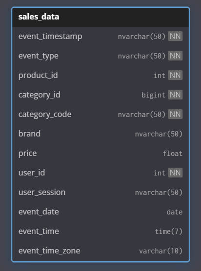

# RFM segmentation in SQL on E-commerce Dataset

A short project that demonstrates how to calculate RFM (Recency, Frequency, Monetary) metrics purely in SQL using a public e-commerce dataset from 
[Kaggle](https://www.kaggle.com/datasets/mkechinov/ecommerce-events-history-in-cosmetics-shop)).

## About
RFM analysis is a method in marketing and customer analytics that helps segment customers based on their behavior.
The acronym RFM stands for:

### Recency (R – time since the last purchase) 
*  How recently the customer made a purchase.
* The shorter the time, the higher the score → the customer is "active."

### Frequency (F – purchase frequency)
* How often the customer makes purchases within a given period.
* The more frequent the purchases, the more loyal the customer is.

### Monetary (M – monetary value of purchases)
* How much the customer spends.
* The higher the value, the more important the customer is.

## SQL table



## Code

```sql
USE [db_cosmetic_store_warehouse];
GO

WITH orders AS (
SELECT
        user_id,
        user_session,
        MAX(event_date) AS last_order, 
        COUNT(*) AS items_count,        
        SUM(price) AS order_amount      
FROM db_cosmetic_store_warehouse.dbo.sales_data
WHERE event_type = 'purchase'
GROUP BY user_id, user_session
), 

user_info AS (
SELECT user_id,
		COUNT(*) AS order_count,
		MAX(last_order) AS last_order,
		CASE 
			WHEN SUM(order_amount) < 0 THEN 0
			ELSE SUM(order_amount)
		END AS total_amount,
		DATEDIFF(DAY, MAX(last_order), 
			(SELECT MAX(event_date)
			FROM db_cosmetic_store_warehouse.dbo.sales_data)) AS difference_in_days
FROM orders
GROUP BY user_id),

segments AS (
SELECT	user_id,
		difference_in_days,
		CASE
			WHEN difference_in_days <= (PERCENTILE_CONT(0.25) WITHIN GROUP (ORDER BY difference_in_days) OVER ()) THEN 4
			WHEN difference_in_days > (PERCENTILE_CONT(0.25) WITHIN GROUP (ORDER BY difference_in_days) OVER ())
				AND difference_in_days <= (PERCENTILE_CONT(0.5) WITHIN GROUP (ORDER BY difference_in_days) OVER ()) THEN 3
			WHEN difference_in_days > (PERCENTILE_CONT(0.5) WITHIN GROUP (ORDER BY difference_in_days) OVER ())
				AND difference_in_days <= (PERCENTILE_CONT(0.75) WITHIN GROUP (ORDER BY difference_in_days) OVER ()) THEN 2
			ELSE 1
		END AS recency_segment,
		order_count,
		CASE
			WHEN order_count <= (1) THEN 1
			WHEN order_count > (1)
				AND order_count <= (3) THEN 2
			WHEN order_count > (3)
				AND order_count <= (8) THEN 3
			ELSE 4
		END AS frequency_segment,
		total_amount,
		CASE
			WHEN total_amount <= (20) THEN 1
			WHEN total_amount > (20)
				AND total_amount <= (50) THEN 2
			WHEN total_amount > (50)
				AND total_amount <= (150) THEN 3
			ELSE 4
		END AS monetary_segment
FROM user_info
WHERE total_amount > 0),

final AS (
SELECT *,
	CONCAT(recency_segment, frequency_segment, monetary_segment) AS RFM_segmentation
FROM segments)


SELECT *
FROM final
--WHERE RFM_segmentation = 444
```

## What's next?
| RFM Code (example) | Segment | What to do | Example action |
|--------------------|---------|------------|----------------|
| **444** | **Champions** | Keep and reward | VIP offers, early access, ask for reviews |
| **424 / 414** | **Loyal Customers** | Increase basket size | Cross-sell, loyalty program |
| **441 / 431** | **Potential Loyalists** | Strengthen relationship | Discount on 2nd order, onboarding series |
| **224** | **About to Sleep** | Re-engage | Limited-time incentive, reminder |
| **243 / 233** | **At Risk** | Save high-value clients | Win-back campaign, VIP care |
| **111** | **Lost** | Close politely | Final reactivation email, then suppress → stop sending promos to protect sender reputation and avoid spam issues |


